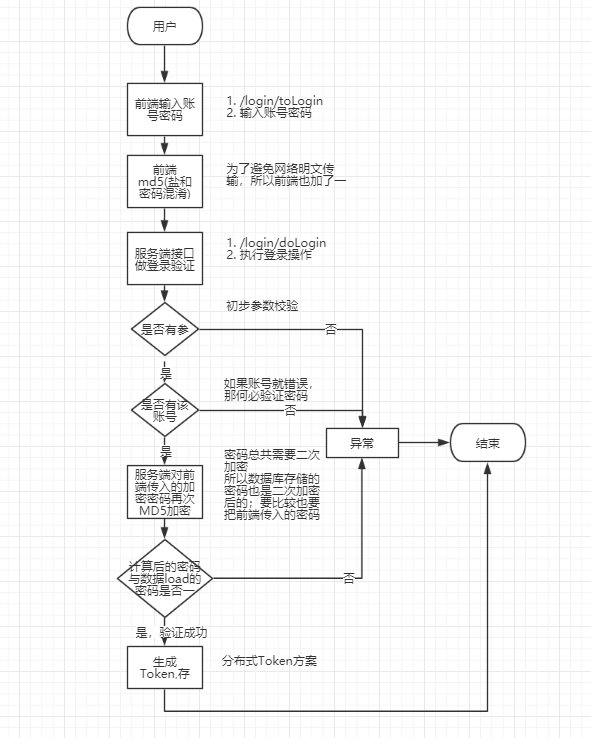

# Spring Boot Seckill Demo

## 流程
----

1. 浏览器输入http://localhost:8080/login/toLogin 跳转到登录页面
2. 账号(手机号)：`13750091178` 密码：`123456`
3. 剩下就看自己了

### 登录验证
[登录验证流程图](resource/img/doLogin.png)

## 实现秒杀功能
----

### 通用返回对象

- Result : 通用返回对象
- CodeMsg : 通用返回信息

### 两次MD5

1. 用户端：Password = MD5(明文 + 固定Salt)   => 防止用户密码明文方式在网络上传输
2. 服务端：Password = MD5(用户输入 + 随机Salt)

### 自定义JSR303参数校验(注解，实现类)

- IsMobile注解
- IsMobileValidator实现类

### 自定义全局异常处理

- GloabalExecptionHandler
- GlobalException

### 分布式Session方案

- 生成token,将token放入cookie,并且将token做为键，登录用户信息作为值存放到远程缓存中(redis)
- 将设置了token的cookie交给response，返回
- 浏览器存储了cookie的token,每次访问就带有这个token
- 后端接收到请求，获取cookie中的token，通过(键)token去redis获取到(值)用户信息
- 根据用户信息判断权限

注意：

- 因为我们需要根据登录用户最后一次访问来设置有限期时间，比如第一次在9点10访问，会话有效期是30分钟，所以会话无效时间是9点40分。
当用户在9点20分时再次访问，我们需要将会话无效时间更新为9点50分。

- 解决方法就是，每次访问的时候重写更新token就可以了

改进：

- 如果我们将所有的操作每次都放在Controller去处理token,那么有多少个请求方法，就需要多少重复的token处理代码，这样非常的麻烦
当然你也会说，可以通过aop去实现，但是这还是不够的优雅。所以我们可以通过重写一些底层的东西去完成这样的操作

### HandlerMethodArgumentResolver - 自定义参数处理器

- 在Controller层，我们看到方法参数中都有User,但是前端并没有传入User，那么这个user是怎么获取到值的呢？
这里其实是通过自定义参数处理器，比如我们的UserArgumentResolver，可以做到，前端传入token, 参数处理器拦截到请求，获取token,根据token去redis捞取User信息，最后
将获取的User信息注入到我们方法的参数中

## JMeter压测
----

### JMeter入门

- 添加线程组(线程数，Ramp-Up(0则代表所有线程数同时启动))
- 添加监听器->聚合报告，图形结果，用表格查看结果(Throughput(qps)一秒多少个线程正确执行)
- 线程组右键->添加取样器->http请求

### 自定义变量模拟多用户

### JMeter命令行使用

- 在windows上录好jmx
- 将jmx文件上传到linux系统中，使用命令行： sh jmeter.sh -n -t xxx.jmx -l result.jtl  ,最后得到result.jtl结果
- 把result.jtl下载到windows，导入到jmeter

### Redis压测工具redis-benchmark

## 页面优化技术
----

- 页面缓存 + URL缓存 + 对象缓存
- 页面静态化(所有页面都是html)，前后端分离
- 静态资源优化
- CDN优化

### 页面缓存

- 取缓存（比如redis中存储着html页面(String格式)）
- 手动渲染模板(如果缓存中没有，则手动渲染得到html（以前是Spring渲染），将得到的html放入缓存)
- 结果输出(将html返回)

### 对象缓存

- 对象缓存就比如说我们的分布式Session方案，通过token去缓存获取User
- 细粒度，通过一个key，获取一个对象
- 总之对象缓存方案就是，首先从缓存获取对象，如果缓存中没有，则从数据库获取，并放入缓存。

### 页面静态化

- 常用技术Angualr,Vue.js ,React.js
- 优点:利用浏览器的缓存

## 服务端秒杀优化
----

- 接口优化

### 接口优化

- Redis预减库存，减少数据库访问
- 内存标记减少Redis访问
- 请求先入队缓存，异步下单，增强用户体验
- Nginx水平扩展

思路： 减少数据库访问

1. 系统初始化，把商品库存数据加载到Redis
2. 收到请求，Redis预减库存，库存不足，直接返回秒杀失败，否则进入3
3. 请求入队，立即返回排队中
4. 请求出队，生成订单，减少库存
5。 客户端轮询，是否秒杀成功
